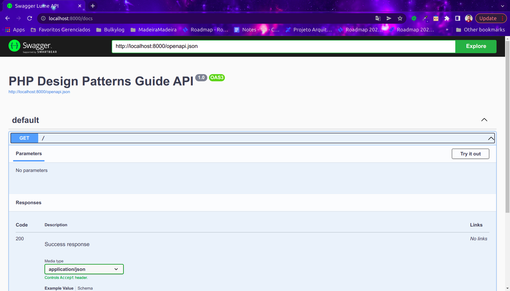

# php-design-patterns-guide  (Work in progress...)
Project containing real examples of design patterns, contain a guide to help the developers interest in this solutions

> All the information provided has been compiled & adapted from many references, some of them cited at the end of the document.
> The guidelines are illustrated by my own examples, fruit of my personal experience writing and reviewing unit tests.

## Table of contents

1. Architectural
   1. Data access
      - [Repository](./docs/architectural/repository.md)
      - [Service layer](./docs/architectural/service-layer.md)
   2. Performance
      - [CQRS]
2. Behavioral
   1. Main patterns 
      - [Chain of responsibility]
      - [Command]
      - [Interpreter]
      - [Iterator]
      - [Memento]
      - [Null object]
      - [State]
      - [Strategy]
      - [Template method]
      - [Visitor]
   2. Other patterns
      - [Caching]
      - [Feature toggle]
      - [Mediator]
      - [Pipeline]
      - [Circuit breaker]
3. Cloud
   - [Health Check Pattern]
   - <s>Claim Check Pattern</s> (Does not apply to this project)
4. Concurrency
   - [Saga]
5. Creational
   1. Main patterns
      - [Abstract factory](./docs/creational/abstract-factory.md)
      - [Builder](./docs/creational/builder.md)
      - [Factory](./docs/creational/factory.md)
      - [Factory method](./docs/creational/factory-method.md)
      - <s>Object pool</s> (Does not apply to this project)
      - <s>Prototype</s> (Does not apply to this project)
      - [Singleton](./docs/creational/singleton.md)
   2. Other patterns
     - [Converter](./docs/creational/converter.md)
     - [Dependency injection] 
     - [Value object](./docs/creational/value-object.md) 
6. Functional
   - There are no examples yet
7. Structural
   - [Adapter]
   - [Bridge]
   - [Composite]
   - [Decorator]
   - [Facade](./docs/structural/facade.md)
   - [Flyweight]
8. Tests Strategies
   1. Main types 
      - [Unit](#)
      - [Integration](#)
      - [Functional/Component](#)
      - [End-to-end](#)
      - [Smoke](#)
      - [API](#)
      - [Regression](#)
      - [UI](#) 
   2. Other types
      - [Stress](#)
      - [Security](#)
      - [Performance](#)
   3. Main resources concepts 
      - [Fixtures](#)
      - [Stubs](#)
      - [Mocks](#)
      - [Helpers](#)
      - [Datasources](#)
      - [Datasets](#)
      - [Dataproviders](#)
     
## Installing
Downloading the composer.
```
./script/install.sh
```

### Enabling the extensions
Check the extensions:
```
php -m
```
Install the other requires extensions:
```
sudo apt install php8.1-xml
sudo apt install php8.1-mbstring
sudo apt install php8.1-mysql
```
Check the extensions:
```
php -m
```


## Swagger
To configure the swagger the first step is to execute the follow command:
```
php artisan swagger-lume:publish
```
Commands details:
* Run `php artisan swagger-lume:publish-config` to publish configs (config/swagger-lume.php)
* Run `php artisan swagger-lume:publish-views` to publish views (resources/views/vendor/swagger-lume)
* Run `php artisan swagger-lume:publish` to publish everything
* Run `php artisan swagger-lume:generate` to generate docs

### Path changes
Open the generated file `config/swagger-lume.php` and change the follow lines:
```
'api' => '/docs',
'docs' => '/openapi.json',
'annotations' => base_path('src/Application'),
'docs_json' => 'openapi.json',
```
### Create the Swagger files
Execute the follow command:
```
php artisan swagger-lume:generate
```

### Generate the required folder structure for views
Execute the follow command:
```
./scripts/lumen/create-storage.sh
```

### See the docs page
Access the follow endpoint:
```
http://localhost:8000/docs
```
Expected result:
.

## Migrations

### Creating migrations

```
php artisan make:migration orders
```

## Running the migrations

## Error Solutions
ERROR: Network service-php-v1 declared as external, but could not be found. Please create the network manually using `docker network create service-php-v1` and try again.

Solution:
```
./scripts/docker/create-network.sh
```

## References
- https://thephpleague.com/
- https://java-design-patterns.com/patterns/
- https://docs.microsoft.com/pt-br/azure/architecture/patterns/
- https://www.eventhelix.com/design-patterns
- https://deviq.com/design-patterns/design-patterns-overview
- https://sourcemaking.com/design_patterns
- https://java-design-patterns.com/patterns
- https://refactoring.guru/design-patterns
- https://www.applause.com/blog/functional-testing-types-examples
- https://martinfowler.com/articles/microservice-testing/
- https://www.atlassian.com/continuous-delivery/software-testing/types-of-software-testing

