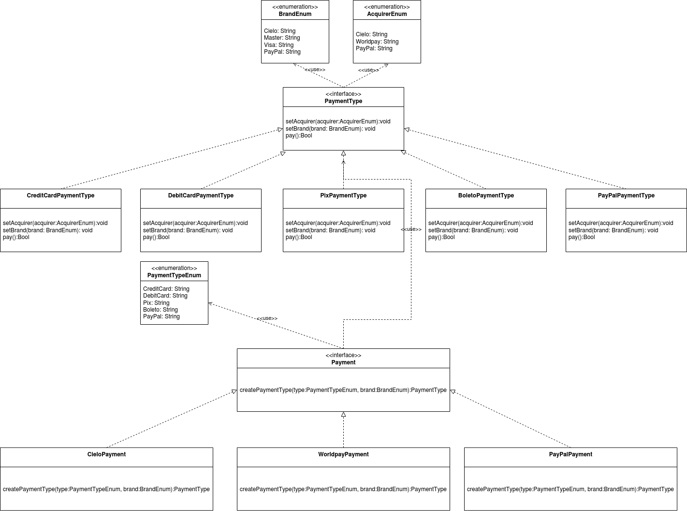

# Factory Method
In class-based programming, the factory method pattern is a creational pattern that uses factory methods to deal with the problem of creating objects without having to specify the exact class of the object that will be created. This is done by creating objects by calling a factory method—either specified in an interface and implemented by child classes, or implemented in a base class and optionally overridden by derived classes—rather than by calling a constructor.

> More details: [Wiki](https://en.wikipedia.org/wiki/Factory_method_pattern)

### Also known as
Virtual Constructor

### Intent
> Define an interface for creating an object, but let subclasses decide which class to instantiate. Factory Method lets a class defer instantiation to subclasses.


### Diagram


---

### Example

Bellow you can see a code snippet of the pattern.
[php file sample](../../snippets/creational/factory-method.php)

> Obs: You can run it, executing the project clone.

### Sample output
Example of output:
```
```

### Project example
Bellow you can see a code snippet of the pattern.
```php
```


### References
- https://en.wikipedia.org/wiki/Factory_method_pattern
- https://sourcemaking.com/design_patterns/factory_method
- https://java-design-patterns.com/patterns/factory-method/
- https://refactoring.guru/pt-br/design-patterns/factory-method

---

[Return to README.md](../../README.md)

